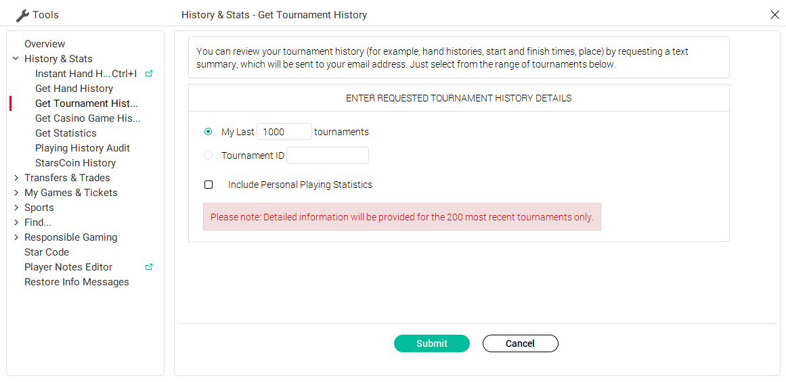

# HistoryParser

This small Python script will parse the history for recent tournaments, and synthesise the stats it needs to calculate the EV for a GT run.

To use, request the tournment history from PokerStars:

* Tools
* History & Stats
* Get Tournament History

Unfortunatelly, PokerStars provides detailed history just for the last 200 games; for GT, that means bounties won, place finished, etc.

You will get an email with the history; save it as a raw file.

# Invoking the script

You can use something like:

`python3 HistoryParser.py myResults.txt 12` with the raw history being the `.txt` file and the last argument the starting tier in GT.

# How it works

Based on the stats from the history, it aggregates the probabilites to describe a tree for a game: bust with no bounties, win X bounties, win X bounties and win table, etc.

It then applies the EV formula for the whole tree and prints some stats, including the ROI.

## Feedback and contributions

All welcome! Feel free to create a pull request.

