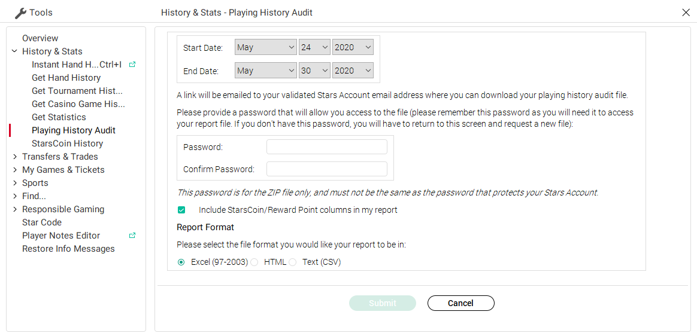
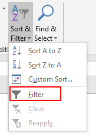
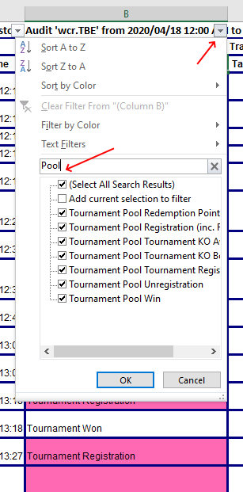
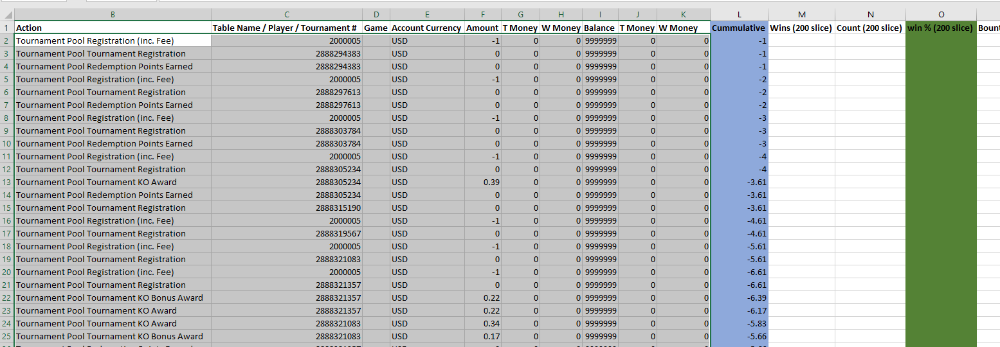
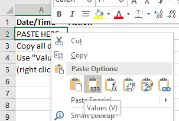
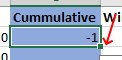
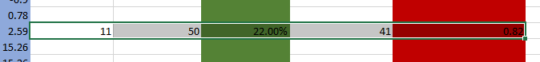

# GT stats extraction

Unfortunatelly, tools like Poker Tracker or Holdem Manager don't properly understand GT stats. This spreadsheet addresses that, synthesising the stats you should care about.

The spreadsheets produces some common sense stats (number of games, profit, ROI, etc.), and three graphs: $ won, table win rate, and bounties / game. The last two are the defining GT stats, and are taken from a sliding window of the average for the last 200 rows at each step in the graph.

## Input

The data required is the PokerStars player audit. You can request it from the client:

* Tools
* History & Stats
* Playing History Audit
* Select the date range
* Add a password (this will be the password for the archive file, doesn't have to be your account password)
* You shouldn't care about StarsCoin/Reward point
* Select **Excel** as format

You should receive the spreadsheet in an email shortly.

## Filtering GT input

The audit includes *everything* that touches your cashier. Naturally, there's going to be a lot of stuff non-GT related.

To select just the GT data, we'll filter by *"Action"*.

Click on the cell called *"Action"*, and then on *"Sort & Filter"* and select *"Filter"*:

You should now see the filter icon on the top cells; click on the one for the *"Action"* column, and in the text box type *"Pool"* (all GT-related actions seem to have this in their name):

Now, we'll copy this (raw) data and use it in the spreadsheet.

Select everything that's been filtered, not including the headers (should be from **A4** to the left and down) and press **Ctrl+C**.

*Hint: you can use **Ctrl + Arrows** to efficiently navigate blocks of cells*

## Replacing data with your own

Go to the `GT.xlsx` spreadsheet now. It already has some sample data. Clear it to make way for the new one.

Select all the similar looking block (as per the headers in the raw audit) - up to *"Cummulative"*. After all is selected, press **Delete**.

Select the (now empty) cell just below *"Action"* in our sheet. Now right click and **Paste**, but use only *"Values"*:

## Applying formulas

The last step is to apply the existing formulas to the new data.

Go to the *"Cummulative"* row. Delete everything but the first row. Select the first row.

To apply the formula to the entire block, note the green square in the lower-right corner of the selection. Double click it:

The $ graph should now be updated.

To do the same for the win rate and bounties / game graphs, look for the formulas in the next four columns. They're a bit below, since they have to start at the first 200 slice.

Once located, do the same as for the *"Cummulative"* column: delete everything below the first row, select the row, and apply it to the block with the lower-right square:

You should now see the graphs updated accordingly.

## Feedback and contributions

All welcome! Feel free to create a pull request.
